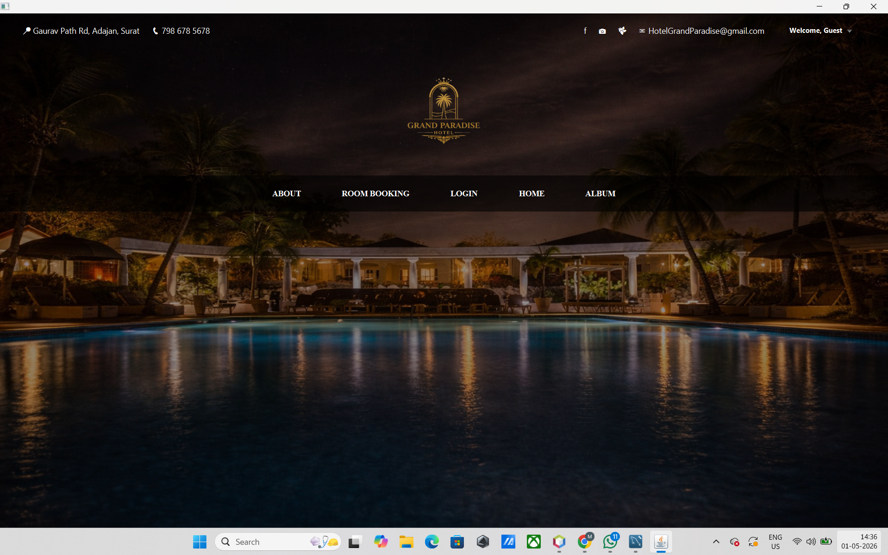
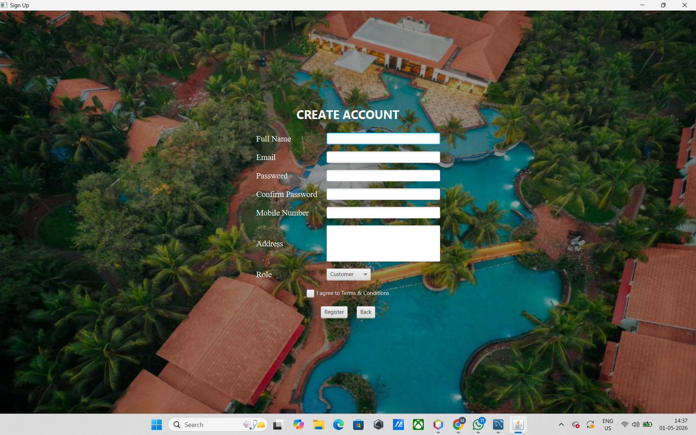
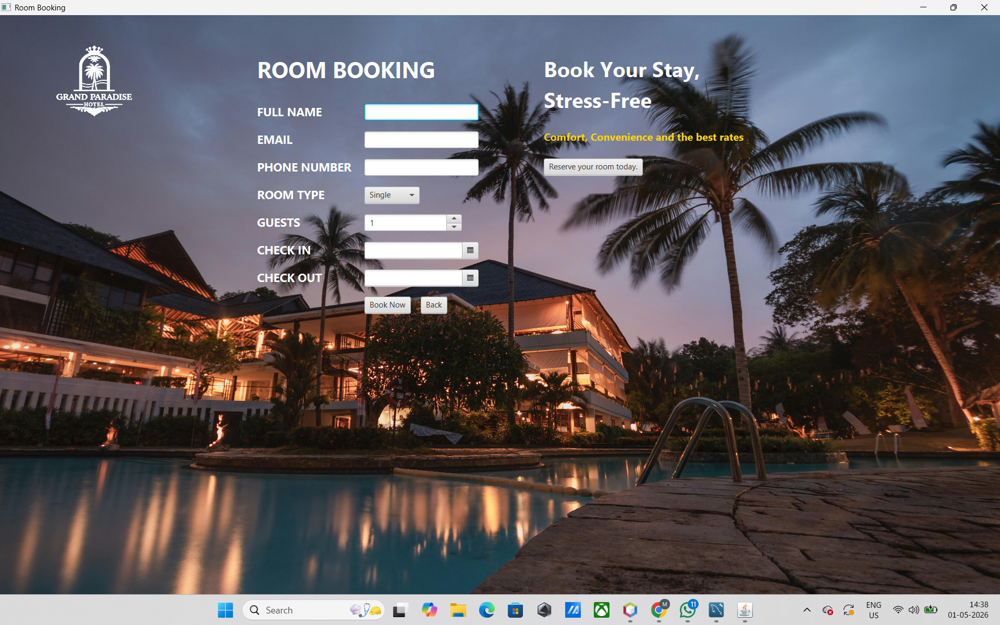
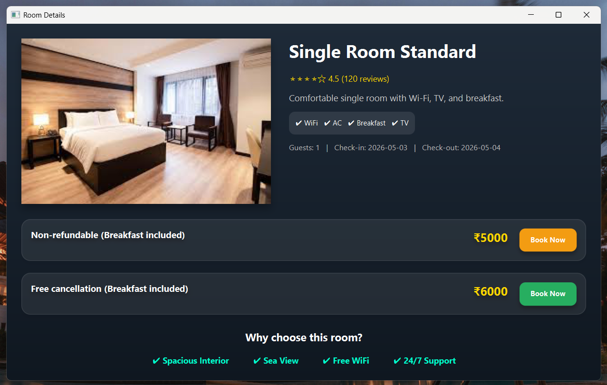
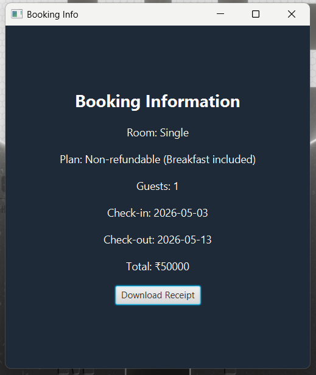
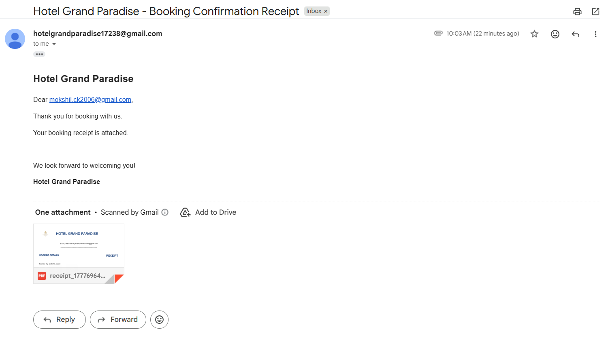
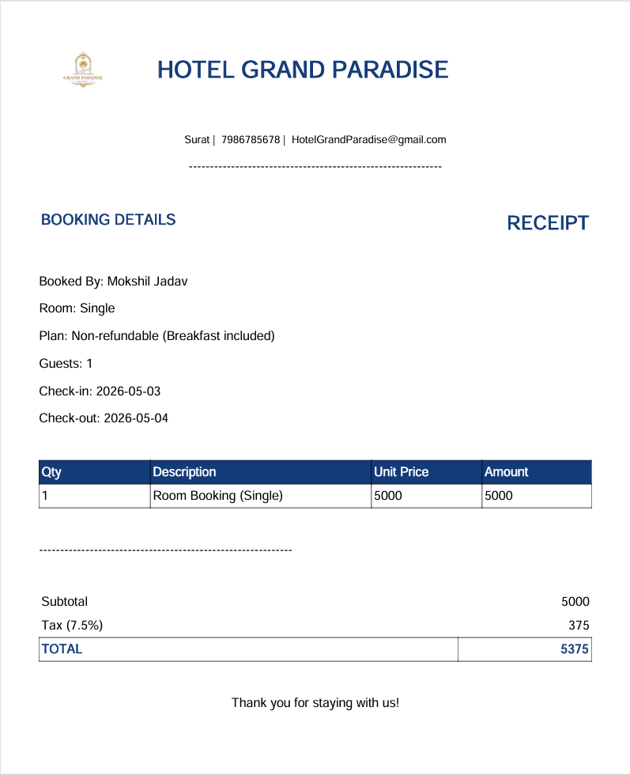

# 🏨 Hotel Management System

A complete **Hotel Management System** developed using **JavaFX** and **MySQL**. This desktop application provides a user-friendly interface for hotel room booking, user authentication, reservation management, PDF receipt generation, and email confirmation.

---

## 📌 Features

- 🔐 User Registration & Login
- 🛏️ Room Booking System
- 📋 Room Details & Pricing
- 📅 Check-in / Check-out Management
- 💳 Booking Confirmation
- 📄 PDF Receipt Generation
- 📧 Automatic Email Receipt Delivery
- 🗄️ MySQL Database Integration
- 🎨 Modern JavaFX GUI

---

## 🛠️ Technologies Used

- Java
- JavaFX
- MySQL
- JDBC
- JavaMail API
- iText PDF

---

## 📸 Project Screenshots

### 🏠 Home Page


---

### 🔐 Login Page


---

### 👤 Create Account


---

### 🛏️ Room Booking


---

### ℹ️ Room Details


---

### 📋 Reservation Summary


---

### 📄 Booking Information


---

### ✅ Booking Confirmation


---

### 📧 Email Receipt


---

### 🧾 PDF Receipt


---

## 📂 Project Structure

```
Hotel Management System
│
├── src/
├── images/
├── database/
├── receipts/
├── lib/
├── build.xml
├── manifest.mf
└── README.md
```

---

## 🚀 How to Run

1. Clone this repository

```bash
git clone https://github.com/dharmeshpat2710/hotel-management-system.git
```

2. Open the project in **NetBeans**.

3. Import the MySQL database.

4. Update the database credentials in the project.

5. Run the application.

---

## ✨ Main Modules

- User Authentication
- Customer Registration
- Hotel Homepage
- Room Details
- Room Booking
- Booking Summary
- Booking Confirmation
- Receipt Generation
- Email Notification

---

## 🎯 Future Improvements

- Online Payment Gateway
- Admin Dashboard
- Room Availability Calendar
- Customer Booking History
- Feedback & Reviews
- QR Code Invoice
- Dark Mode

---

## 👨‍💻 Developer

**Dharmesh Patel**

BE Information Technology  
C. K. Pithawala College of Engineering & Technology  
Gujarat Technological University (GTU)

---

## ⭐ If you like this project

Please consider giving this repository a ⭐ on GitHub.
